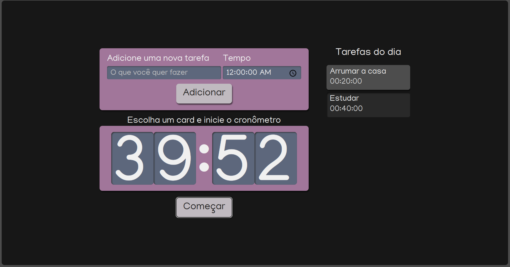

### Criando app
```
$ npx create-react-app insert-project-directory-here --template typescript --use-npm alura-studies
```
### Rodando app
```
$ cd insert-project-directory-here
$ npm start
```
### Instalando Sass
```
$ npm install --save-dev sass
```
### Instalando css-modules
```
$ npm install -D typescript-plugin-css-modules
```
### Instalando pacote de id
```
$ npm i uuid
$ npm i --save-dev @types/uuid
```
### Projeto
<h1 align="center">
  <a href="https://alura-react-10xphr2y7-margaridamarina.vercel.app//">
   
</h1>
